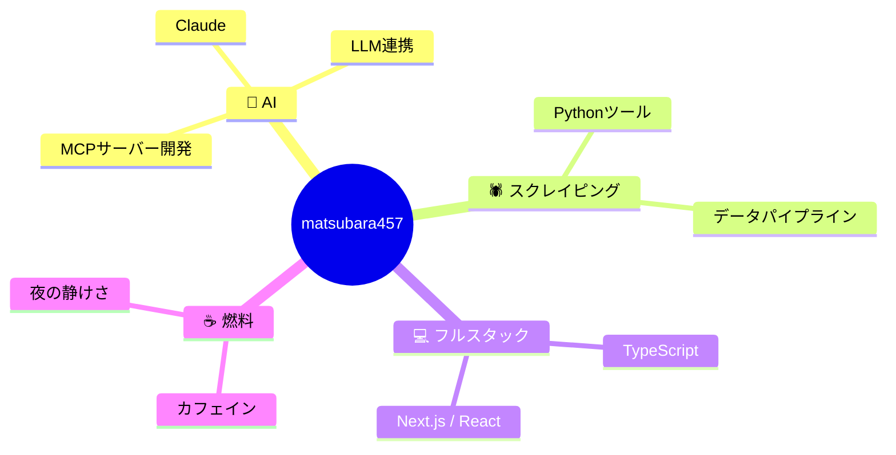

<!-- 🌈🌈🌈 REVOLUTIONARY PROFILE 🌈🌈🌈 -->

<div align="center">

<!-- ░░░ ヒーローバナー ░░░ -->


<!-- ░░░ タイピングアニメ（日本語） ░░░ -->
<a href="#"></a>

<br/>

<!-- ░░░ ステータスバッジ群 ░░░ -->


<br/><br/>

<!-- ░░░ プロフィール閲覧数 ░░░ -->


</div>

---

## 🎬 ひとことで言うと

<div align="center">

### 「AIをこき使って、面白いものを量産する人」

</div>

```python
class Matsubara457:
    def __init__(self):
        self.role        = "AIエンジニア / フルスタック開発者"
        self.specialties = ["AIエージェント", "Webスクレイピング", "MCPサーバー"]
        self.languages   = ["Python 🐍", "TypeScript 🦕", "JavaScript ⚡"]
        self.fuel        = "☕ カフェイン100%"
        self.motto       = "とりあえず動かす。話はそれからだ。"

    def current_status(self):
        return "🔥 何か面白いものを作っている最中..."

    def life_philosophy(self):
        # 難しいことは、AIに聞く
        return "わからん時はClaudeに相談 🙏"
```

---

## 🗺️ 私のことを地図にすると



---

## 🛠️ 武器庫（使える道具たち）

<div align="center">

| カテゴリ | 道具 |
|:---:|:---|
| 🐍 **言語** |    |
| 🤖 **AI** |    |
| ⚡ **フレームワーク** |    |
| 🕷️ **データ** |   |

</div>

---

## 📊 数字で見る私（リアルタイム更新）

<div align="center">
  
  
</div>

<div align="center">
  
</div>

---

## 🐍 コントリビューションを蛇が食べる

<div align="center">
  
  <br/>
  <sub>↑ 緑のマスを蛇が食べていくアニメ（GitHub Actionsで自動生成可・後述）</sub>
</div>

---

## 📈 活動の波

<div align="center">
  
</div>

---

## 🏆 集めたトロフィー

<div align="center">
  
</div>

---

## 🔥 イチオシ作品

<div align="center">

[](https://github.com/matsubara457/cafe-aura-mcp)
[](https://github.com/matsubara457/claude-code-templates)

[](https://github.com/matsubara457/my-slack-bot)
[](https://github.com/matsubara457/scrapling-verify)

</div>

---

## 🎮 今日の運勢 & ひとくちネタ

<div align="center">

<!-- 毎日変わる開発者ジョーク -->


</div>

---

## 💡 こんな時、声かけてください

<div align="center">

> 🤖 **「AIで何か自動化したい」** → 得意です  
> 🕷️ **「このサイトのデータが欲しい」** → スクレイピングします  
> ⚡ **「Web アプリ作りたい」** → フルスタックでいけます  
> ☕ **「ただ雑談したい」** → コーヒー片手にどうぞ

</div>

---

<div align="center">

### 🤝 つながりましょう！

[](https://github.com/matsubara457)

<br/>


<sub>⭐ 気に入ったらスター押してくれると、夜のテンションが上がります</sub>

</div>
